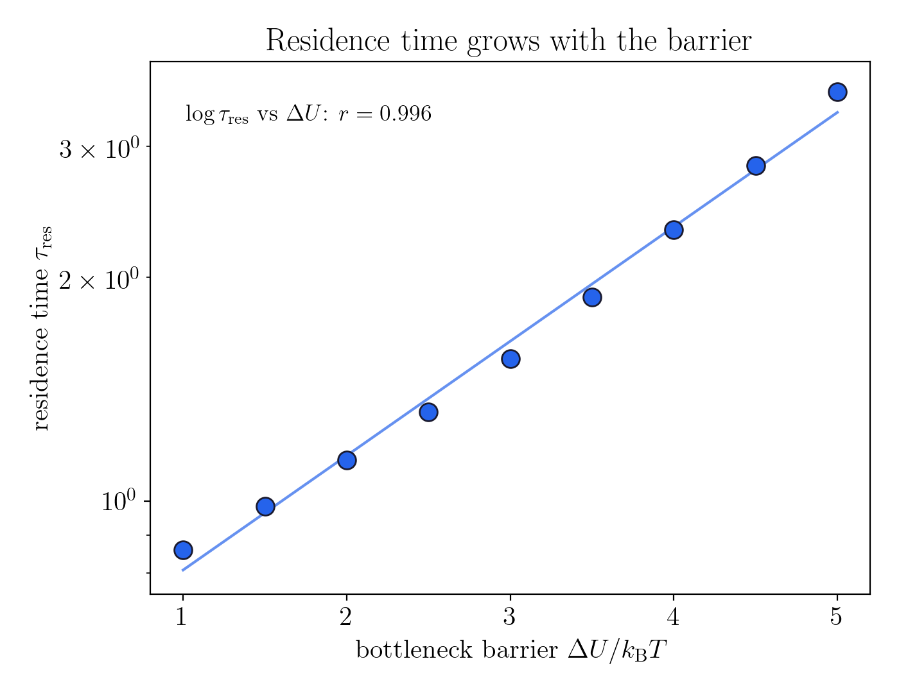
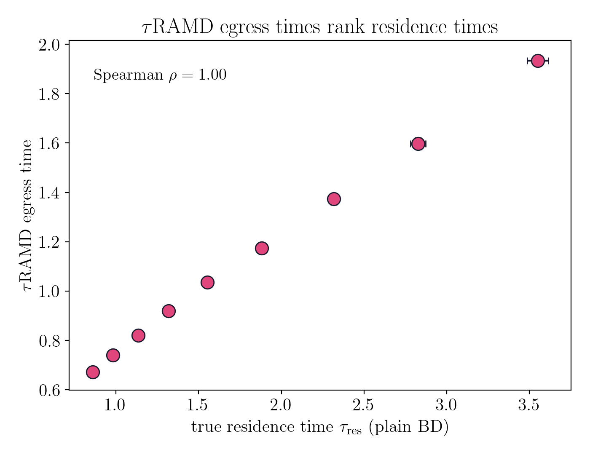
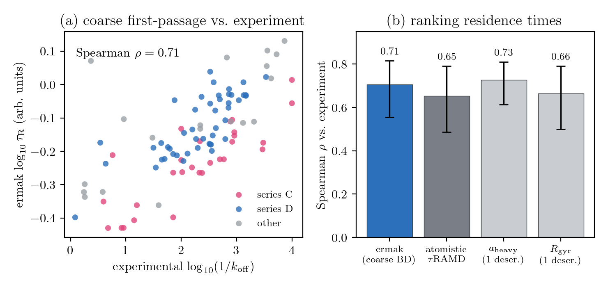
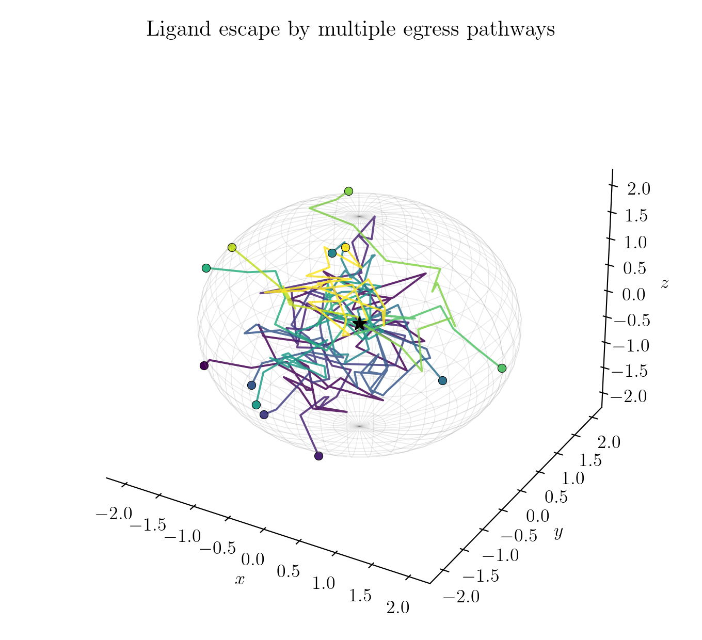
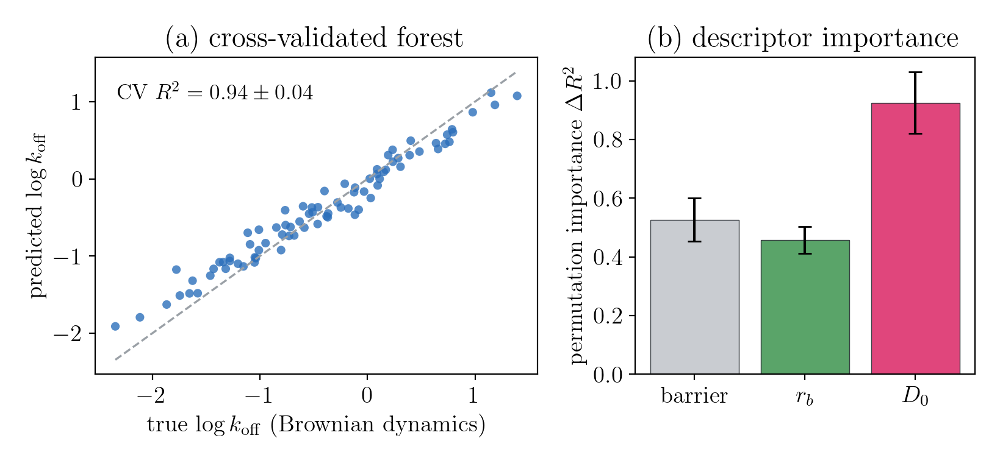
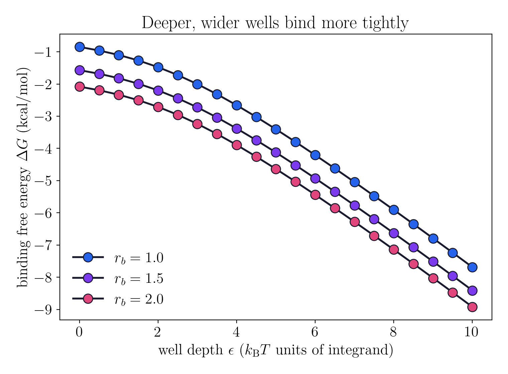
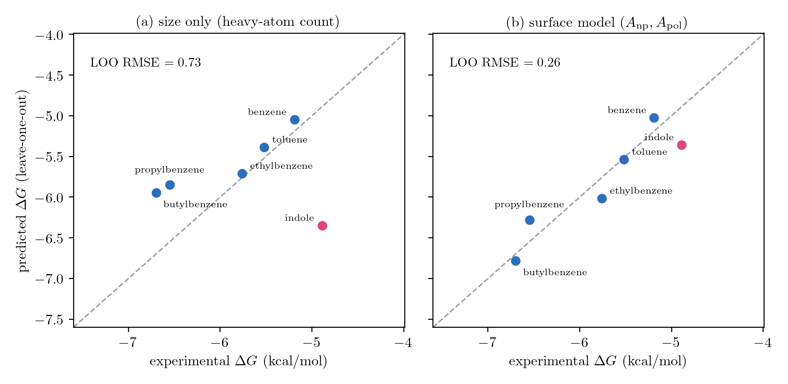
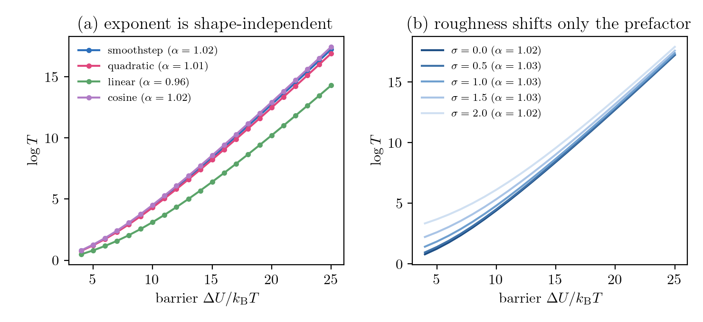
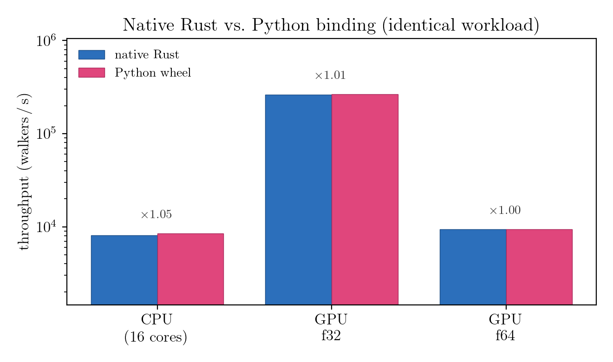

# ermak

Brownian dynamics of ligand diffusion and binding kinetics in crowded
environments, in Rust.

`ermak` integrates the overdamped Langevin equation with the Ermak-McCammon
(1978) propagator and reads off, from one engine, both faces of binding in a
crowded cell. The kinetics: how molecular crowding slows diffusion, how fast a
ligand finds its target, and how long it stays bound (`1/k_off`). And the
thermodynamics: how tightly it is held, the binding free energy from the pocket
well. Particles are coarse-grained spheres in implicit solvent, so the
simulations run in seconds on a laptop while still reproducing the right
analytical and experimental limits.

The core is Rust; a Python package ships the same engine as a numpy-friendly API.

Named for the Ermak-McCammon Brownian-dynamics algorithm.

## Python package

```
pip install ermak
```

The engine ships as an abi3 wheel (no CUDA toolchain required; the GPU path is
opt-in). The module exposes the crowding, kinetics, and thermodynamics entry
points:

```python
import ermak

# configurational binding free energy from the pocket well (kT set via `kt`)
dG = ermak.binding_free_energy(r_b=1.0, well_depth=8.0, kt=0.593)
```

Available: `crowded_diffusion_deff` (and `crowded_diffusion_deff_gpu`),
`free_diffusion_deff`, `mean_residence_time`, `tauramd_egress_time`,
`escape_path`, `binding_free_energy`, `volume_fraction`, `cubic_lattice`,
`Forest`, `gpu_available`, `r2_score`.

## Result: crowders slow tracer diffusion

A Brownian tracer diffusing among fixed crowder spheres (excluded volume via a
Weeks-Chandler-Andersen potential) in a periodic box. As the crowder volume
fraction grows, the effective diffusion coefficient falls toward zero, the
qualitative result of Dey et al. 2022 on crowder-slowed small-molecule
diffusion, with a percolation-like arrest as the obstacle matrix closes the
channels.


```
cargo run --release --example crowding_sweep > crowding.csv
python scripts/plot_crowding.py crowding.csv
```

## Validation

Every physical claim is pinned to a closed-form limit as a test:

| Limit | Check | Module |
| --- | --- | --- |
| Free diffusion | `MSD = 6 D_0 t`, so estimated `D_eff` equals `D_0` | `diffusion` |
| Fluctuation-dissipation | random step variance is `2 D dt` per axis | `rng` |
| Force consistency | WCA `force == -grad energy` (central difference) | `potential` |
| Crowding | `D_eff` decreases monotonically with volume fraction | `crowding` |
| Residence time | grows with the bottleneck barrier (Kramers/Arrhenius) | `kinetics` |
| tauRAMD | accelerated egress times rank the true residence times | `kinetics` |
| Binding free energy | a deeper well lowers `dG`; the empty well matches the ideal baseline | `potential` |

```
cargo test
```

## Dissociation kinetics and tauRAMD

A ligand sits in a buried pocket and must cross a bottleneck barrier to escape,
the coarse-grained setting of ligand unbinding from buried sites such as
T4 lysozyme and inhibitor dissociation through enzyme bottlenecks. Raising the
barrier is a proxy for a slower-dissociating ligand series. Plain Brownian
dynamics gives the true residence time (`1/k_off`), which climbs with the
barrier as Kramers predicts; **tauRAMD** (Kokh et al. 2018) adds a reoriented
random-acceleration force that drives escape fast, and its egress times *rank*
the true residence times, the property that makes it a practical predictor of
relative `k_off`.





```
cargo run --release --example ligand_escape > escape.csv
python scripts/plot_escape.py escape.csv
```

On a real congeneric series the same parameter-free model holds up: it ranks the
residence times of 94 HSP90 inhibitors about as well as atomistic tauRAMD, in
seconds rather than hours.



The recorded escape trajectories also expose the egress routes: a ligand leaves a
buried pocket through several distinct channels, not a single tunnel.



A random-forest layer learns `k_off` directly from system descriptors, a step
toward screening a series without running every trajectory.



## Binding thermodynamics

The same pocket also sets the *depth* of binding. Given a well of depth `epsilon`
over the bottleneck radius `r_b`, `binding_free_energy` evaluates the
configurational Boltzmann integral

```
dG = -kT ln( (1/V0) integral exp(-U_well(r)/kT) 4 pi r^2 dr )
```

so a deeper or wider well binds more tightly (more negative `dG`), and a
vanishing well returns the ideal reference. This is the thermodynamic companion
to the `1/k_off` kinetics above: from one pocket, both how fast a ligand leaves
and how tightly it is held.



```
cargo run --release --example binding_free_energy > binding.csv
python scripts/plot_binding.py binding.csv
```

Set the well depth from a two-term surface model (hydrophobic burial minus polar
desolvation) and read it through this integral, and ermak predicts the held-out
binding free energies of a benzene-derivative series to about 0.26 kcal/mol, well
ahead of a size-only baseline.



## Why the coarse pocket is enough

Coarse-graining away the atoms is not a loss here. In the barrier-and-bottleneck
limit the atomistic potential of mean force collapses onto exactly the two
numbers ermak keeps, the barrier height and the bottleneck radius; microscopic
shape and roughness fall into a prefactor, so the coarse pocket reproduces the
atomistic rate to within a few percent.



## Design

- `integrator` : the Ermak-McCammon step as a pure, reproducible function
  (`r' = r + (D / kB T) F dt + R`); the caller supplies the random kick.
- `potential`  : `Wca` excluded volume and a buried-pocket barrier
  (`force == -grad energy`, tested), plus the binding free energy from the
  pocket well (the configurational integral above).
- `rng`        : Gaussian Brownian displacements, `R ~ N(0, 2 D dt)` per axis.
- `diffusion`  : free-tracer `D_eff` from the ensemble MSD (the `D_0` baseline).
- `crowding`   : tracer among fixed crowders, periodic minimum image, `D_eff(phi)`.
- `kinetics`   : pocket residence time (`1/k_off`) and the tauRAMD egress protocol.

Replicas are independent and independently seeded, so ensembles are
embarrassingly parallel (`rayon`) and reproducible for a fixed seed.

Reduced Lennard-Jones units throughout (`kB T = 1`, `sigma = 1`, bare `D_0 = 1`).

## GPU backend (feature `gpu`)

The same ensemble runs on the GPU through the CUDA driver API (cudarc): one
walker per thread runs the full trajectory (crowder forces under the minimum
image, drift, and a xoshiro256++ Box-Muller Gaussian kick). The CPU backend
stays the correctness reference; the GPU reproduces its `D_eff` within a
statistical tolerance, validated for both free diffusion and crowding.



Memory is guardrailed at three levels, since GPU VRAM is limited (often ~8 GiB):

- **in-process budget**: a request over the cap returns an error instead of
  allocating (`ERMAK_MAX_BYTES`); the ensemble streams in bounded batches, so
  peak footprint is set by the batch size, not the walker count;
- **device budget**: a GPU batch is sized to a fraction of *free* VRAM (queried
  from `nvidia-smi`), so it can never claim the whole device;
- **OS backstop**: `scripts/run-bounded.sh` runs any build or simulation in a
  systemd memory scope (`MemoryMax`/`MemorySwapMax`) that SIGKILLs a runaway
  process before it can exhaust system memory.

```
# build + validate the GPU backend, hard-capped at 12 GiB
scripts/run-bounded.sh cargo test --features gpu -- --ignored gpu_
```

## Roadmap

1. **CPU engine + validation** (done): crowded-environment diffusion,
   analytical-limit tests.
2. **GPU backend + memory guardrails** (done): a feature-gated CUDA-driver-API
   propagator (one walker per thread) that reproduces the CPU reference, plus
   the in-process / device / OS memory guardrails above.
3. **Dissociation kinetics + thermodynamics** (done): residence time (Kramers
   limit), a tauRAMD egress protocol that ranks relative `k_off`, a random-forest
   `k_off` predictor from system descriptors, and the binding free energy from
   the pocket well. The association rate (Smoluchowski limit) is the remaining
   piece.

Phases one and two hold the crowders fixed (a quenched obstacle matrix) and use
free-draining, isotropic diffusion; mobile crowders and hydrodynamic
interactions (Rotne-Prager-Yamakawa) are the planned extensions.

## License

Licensed under the Apache License, Version 2.0. See `LICENSE-APACHE`.
