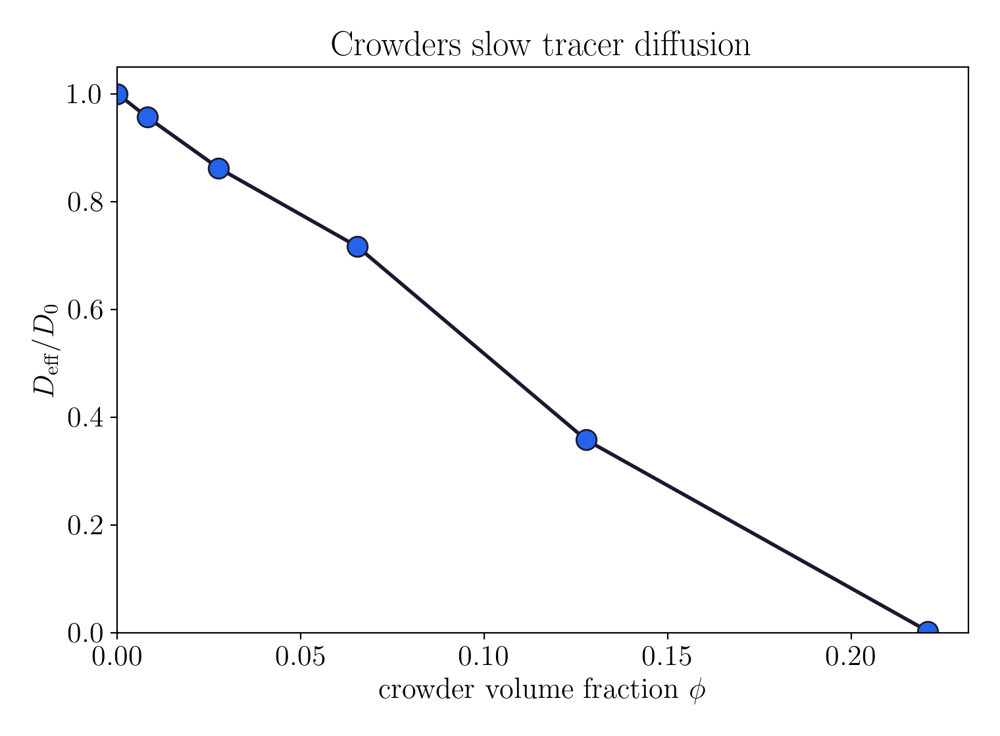
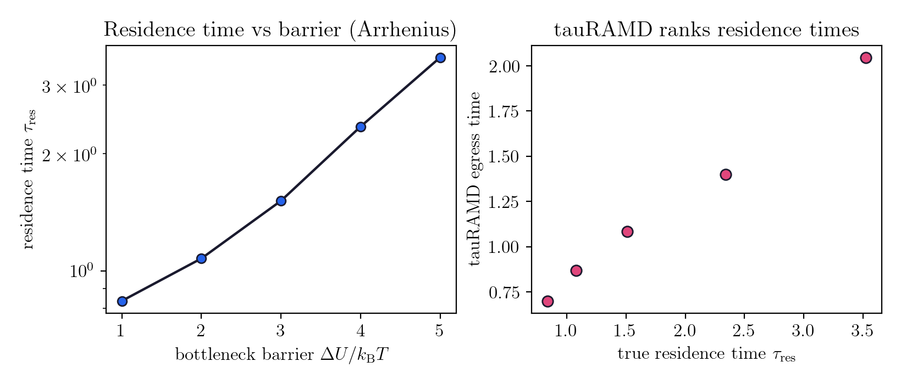

# ermak

Brownian dynamics of ligand diffusion and binding kinetics in crowded
environments, in Rust.

`ermak` integrates the overdamped Langevin equation with the Ermak-McCammon
(1978) propagator and uses it to measure, on one engine, the three quantities a
binding-kinetics study cares about: how molecular crowding slows diffusion, how
fast a ligand finds its target, and how long it stays bound. Particles are
coarse-grained spheres in implicit solvent, so the simulations run in seconds on
a laptop while still reproducing the right analytical and experimental limits.

Named for the Ermak-McCammon Brownian-dynamics algorithm.

## Result: crowders slow tracer diffusion

A Brownian tracer diffusing among fixed crowder spheres (excluded volume via a
Weeks-Chandler-Andersen potential) in a periodic box. As the crowder volume
fraction grows, the effective diffusion coefficient falls toward zero, the
qualitative result of Dey et al. 2022 on crowder-slowed small-molecule
diffusion, with a percolation-like arrest as the obstacle matrix closes the
channels.



```
cargo run --release --example crowding_sweep > crowding.csv
python scripts/plot_crowding.py crowding.csv
```

## Validation

Every physical claim is pinned to a closed-form limit as a test:

| Limit | Check | Module |
| --- | --- | --- |
| Free diffusion | `MSD = 6 D_0 t`, so estimated `D_eff` equals `D_0` | `diffusion` |
| Fluctuation-dissipation | random step variance is `2 D dt` per axis | `rng` |
| Force consistency | WCA `force == -grad energy` (central difference) | `potential` |
| Crowding | `D_eff` decreases monotonically with volume fraction | `crowding` |
| Residence time | grows with the bottleneck barrier (Kramers/Arrhenius) | `kinetics` |
| tauRAMD | accelerated egress times rank the true residence times | `kinetics` |

```
cargo test
```

## Dissociation kinetics and tauRAMD

A ligand sits in a buried pocket and must cross a bottleneck barrier to escape,
the coarse-grained setting of Nunes-Alves's work on ligand escape from
T4 lysozyme and inhibitor dissociation through NiFe-hydrogenase bottlenecks.
Raising the barrier is a proxy for a slower-dissociating ligand series. Plain
Brownian dynamics gives the true residence time (`1/k_off`), which climbs with
the barrier as Kramers predicts; **tauRAMD** (her signature method) adds a
reoriented random-acceleration force that drives escape fast, and its egress
times *rank* the true residence times, the property that makes it a practical
predictor of relative `k_off`.



```
cargo run --release --example ligand_escape > escape.csv
python scripts/plot_escape.py escape.csv
```

## Design

- `integrator` : the Ermak-McCammon step as a pure, reproducible function
  (`r' = r + (D / kB T) F dt + R`); the caller supplies the random kick.
- `potential`  : `Wca` excluded volume and a buried-pocket barrier
  (`force == -grad energy`, tested).
- `rng`        : Gaussian Brownian displacements, `R ~ N(0, 2 D dt)` per axis.
- `diffusion`  : free-tracer `D_eff` from the ensemble MSD (the `D_0` baseline).
- `crowding`   : tracer among fixed crowders, periodic minimum image, `D_eff(phi)`.
- `kinetics`   : pocket residence time (`1/k_off`) and the tauRAMD egress protocol.

Replicas are independent and independently seeded, so ensembles are
embarrassingly parallel (`rayon`) and reproducible for a fixed seed.

Reduced Lennard-Jones units throughout (`kB T = 1`, `sigma = 1`, bare `D_0 = 1`).

## GPU backend (feature `gpu`)

The same ensemble runs on the GPU through the CUDA driver API (cudarc): one
walker per thread runs the full trajectory (crowder forces under the minimum
image, drift, and a xoshiro256++ Box-Muller Gaussian kick). The CPU backend
stays the correctness reference; the GPU reproduces its `D_eff` within a
statistical tolerance, validated for both free diffusion and crowding.

Memory is guardrailed at three levels, because this machine has been OOM-killed
before and the GPU has only ~8 GiB of VRAM:

- **in-process budget**: a request over the cap returns an error instead of
  allocating (`ERMAK_MAX_BYTES`); the ensemble streams in bounded batches, so
  peak footprint is set by the batch size, not the walker count;
- **device budget**: a GPU batch is sized to a fraction of *free* VRAM (queried
  from `nvidia-smi`), so it can never claim the whole device;
- **OS backstop**: `scripts/run-bounded.sh` runs any build or simulation in a
  systemd memory scope (`MemoryMax`/`MemorySwapMax`) that SIGKILLs a runaway
  before it can take down the machine.

```
# build + validate the GPU backend, hard-capped at 12 GiB
scripts/run-bounded.sh cargo test --features gpu -- --ignored gpu_
```

## Roadmap

(see the `ermak-planning` repo for the design spec):

1. **CPU engine + validation** (done): crowded-environment diffusion,
   analytical-limit tests.
2. **GPU backend + memory guardrails** (done): a feature-gated CUDA-driver-API
   propagator (one walker per thread) that reproduces the CPU reference, plus
   the in-process / device / OS memory guardrails above.
3. **Dissociation kinetics** (done): residence time (Kramers limit) and a
   tauRAMD egress protocol that ranks relative `k_off`. An ML layer predicting
   `k_off` from system descriptors, and the association rate (Smoluchowski
   limit), are the remaining pieces.

Phases one and two hold the crowders fixed (a quenched obstacle matrix) and use
free-draining, isotropic diffusion; mobile crowders and hydrodynamic
interactions (Rotne-Prager-Yamakawa) are the planned extensions.

## License

Dual-licensed under MIT or Apache-2.0, at your option.
